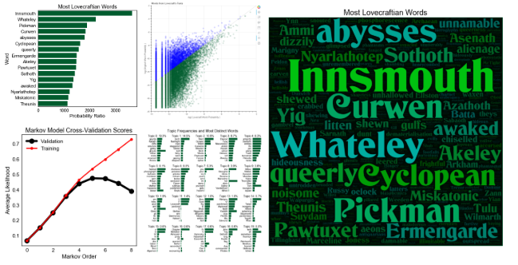
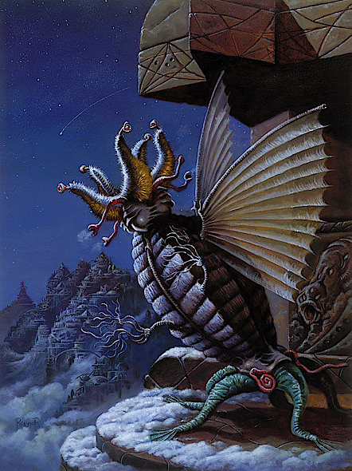

# H.P. Lovecraft NLP Data Project

***Nix Barnett***

This project is an analysis of the complete works of writer [H. P. Lovecraft](https://en.wikipedia.org/wiki/H._P._Lovecraft), using various techniques from natural language processing (NLP). In it, I **scrape Lovecraft's complete works from the web**, as well as a set of English word counts that serves as a baseline for comparison. I first use this data to quantify and visualize the most (and least) **"Lovecraftian" words**, as well as examining words that are commonly associated with Lovecraft. I then perform **topic modeling (latent Dirichlet allocation)** to extract and thoroughly interpret topics from Lovecraft's works, using a custom technique that eliminates the need for stop word removal. I end the project by building a **character-based Markov language model and text generator** using no libraries (aside from NumPy). I find the optimal Markov order for this model using cross-validation, use the model to imitate Lovecraft's writing, and analyze the most common nonsensical words generated by the model. The project is written mostly in a tutorial format.

## Tools 
The project is coded in **[Python](https://www.python.org/)** using **[JupyterLab](https://github.com/jupyterlab/jupyterlab)** notebooks. All web-scraping is performed using **[Requests](http://docs.python-requests.org/en/master/)** and **[Beautiful Soup](https://www.crummy.com/software/BeautifulSoup/)**. Most text processing is performed using custom functions, with some simple word tokenization by **[NLTK](https://www.nltk.org/)**. The data is stored and transformed using primarily **[pandas](https://pandas.pydata.org/)** and **[NumPy](http://www.numpy.org/)**. All custom plots are designed using **[seaborn](https://seaborn.pydata.org/)**, **[Matplotlib](https://matplotlib.org/)**, and **[Bokeh](https://bokeh.pydata.org/en/latest/)** (for interactive plots), and customized word clouds are generated using **[wordcloud](https://github.com/amueller/word_cloud)**. **[Scikit-learn](http://scikit-learn.org)** is used for topic modeling (latent Dirichlet allocation). All text is written in **[Markdown](https://daringfireball.net/projects/markdown/)**, with equations written in **[LaTeX](https://www.latex-project.org/)**.

---

# **[Click here to load the project!](http://nbviewer.jupyter.org/github/nxbrnt/lovecraft_data_project/blob/master/lovecraft_data_project.ipynb)**
